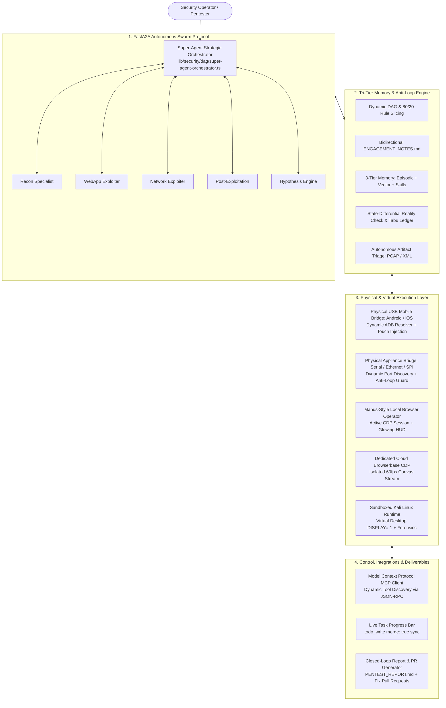

<p align="center">
  <a href="https://redhunter-ai.co.in/">
    
  </a>
</p>

<h1 align="center">RedHunter AI</h1>

<h2 align="center">Autonomous AI Red Team Operator & Multi-Agent Offensive Security Swarm</h2>

<div align="center">

[](https://redhunter-ai.co.in)
[](https://nextjs.org)
[](https://www.typescriptlang.org)
[](https://www.docker.com)
[]
(#3-fasta2a-multi-agent-swarm-protocol)
[](#1-physical-usb-mobile-hardware-bridge-android--ios)
[](#tri-mode-offensive-testing-engine)
[](LICENSE)

</div>

---

**RedHunter AI** is an enterprise-grade autonomous offensive cybersecurity platform engineered for security operations (SecOps) teams, penetration testers, and bug bounty researchers. Moving far beyond simplistic LLM wrappers and static vulnerability scanners, RedHunter AI operates as a **stateful, human-equivalent red team swarm** capable of reasoning, planning multi-phase attack trees, learning from tool execution failures, synthesizing polyglot exploit harnesses, manipulating physical mobile devices over USB, bridging physical network appliances and embedded microcontrollers, and executing full campaigns inside an isolated Kali Linux runtime.

---

- [Executive Comparison: Traditional vs. RedHunter AI](#executive-comparison-traditional-vs-redhunter-ai)
- [Comprehensive Technical Operator Manual & Guide (GUIDE.md)](GUIDE.md)
- [Comprehensive User Guidance & Multi-Domain Testing Manual (USER_GUIDANCE.md)](USER_GUIDANCE.md)
- [Tri-Mode Offensive Testing Engine](#tri-mode-offensive-testing-engine)
  - [The Power of Black Box: The True Autonomy Test](#the-power-of-black-box-the-true-autonomy-test)
  - [Multi-Surface Execution Matrix (Web, Network, Cloud, Mobile, Embedded/IoT, OSINT/GEOINT)](#multi-surface-execution-matrix)
- [12 Core Architectural Pillars & Capabilities](#12-core-architectural-pillars--capabilities)
  - [1. Physical USB Mobile Hardware Bridge (Android & iOS)](#1-physical-usb-mobile-hardware-bridge-android--ios)
  - [2. Physical Hardware & Network Appliance Bridge (Routers, Switches, Firewalls, IoT)](#2-physical-hardware--network-appliance-bridge-routers-switches-firewalls-iot)
  - [3. Autonomous Dual-Browser Operator (Manus-Style Local + Cloud CDP)](#3-autonomous-dual-browser-operator-manus-style-local--cloud-cdp)
  - [4. FastA2A Multi-Agent Swarm Protocol & Agent Cards](#4-fasta2a-multi-agent-swarm-protocol--agent-cards)
  - [5. Multi-Engine Desktop GUI Automation ("Computer Use")](#5-multi-engine-desktop-gui-automation-computer-use)
  - [6. Dynamic 3-Gear Action Engine & Zero-Loop Stagnation Guard](#6-dynamic-3-gear-action-engine--zero-loop-stagnation-guard)
  - [7. Tri-Tier Memory Architecture & Persistent Campaign Graph](#7-tri-tier-memory-architecture--persistent-campaign-graph)
  - [8. Sandboxed Kali Linux Runtime & Digital Forensics Suite (with Zero-Trust Upload Quarantine)](#8-sandboxed-kali-linux-runtime--comprehensive-dfir-suite)
  - [9. Model Context Protocol (MCP) & Enterprise Connectors](#9-model-context-protocol-mcp--enterprise-connectors)
  - [10. Real-Time Task Progress Bar & Live State Synchronization](#10-real-time-task-progress-bar--live-state-synchronization)
  - [11. Deep Vulnerability Root Cause Analysis (RCA) & Remediation Hotpatching](#11-deep-vulnerability-root-cause-analysis-rca--remediation-hotpatching)
  - [12. Advanced OSINT, GEOINT & 12-Layer Multimodal Deepfake Forensic Framework](#12-advanced-osint-chronolocation--geospatial-intelligence-geoint-suite)
    - [12-Layer Multimodal Deepfake & Synthetic Media Detection](#12-layer-multimodal-deepfake--synthetic-media-detection)
    - [Ground-Truth Reference Baseline Differential Analysis (Side-by-Side Calibration)](#ground-truth-reference-baseline-differential-analysis-side-by-side-calibration)
    - [CCTV & Convex Mirror Optical Inversion and Forensic Contrast Deck](#cctv--convex-mirror-optical-inversion-and-forensic-contrast-deck)
    - [Court-Admissible FRE 902(14) Reporting](#court-admissible-fre-90214-reporting)
- [Interactive Live Computer Studio UI](#interactive-live-computer-studio-ui)
- [Getting Started & Installation](#getting-started--installation)
  - [System Prerequisites](#system-prerequisites)
  - [Environment Configuration](#environment-configuration)
  - [Running the Sandboxed Kali Linux Runtime](#running-the-sandboxed-kali-linux-runtime)
  - [Launching the Development Server](#launching-the-development-server)
- [Comprehensive Codebase Architecture](#comprehensive-codebase-architecture)
- [Ethical Use & Responsible Disclosure](#ethical-use--responsible-disclosure)
- [License](#license)

---

## Executive Comparison: Traditional vs. RedHunter AI

```
┌─────────────────────────────────┬─────────────────────────────────┬─────────────────────────────────┐
│     TRADITIONAL PEN-TEST        │       LEGACY DAST SCANNERS      │      REDHUNTER AI PLATFORM      │
├─────────────────────────────────┼─────────────────────────────────┼─────────────────────────────────┤
│ • Annual / Periodic (1x/yr)     │ • Scheduled / Triggered scans   │ • 24/7 Continuous CART Swarm    │
│ • $30,000–$100,000 per audit    │ • $15,000–$40,000/yr licenses   │ • Bottom-up SaaS / Self-hosted  │
│ • 4–8 week turnaround           │ • Hours (produces raw output)   │ • Minutes to hours (Live PoC)   │
│ • 80-page static PDF document   │ • 70%+ False-Positive Noise     │ • Zero-Noise Verified Evidence  │
│ • Zero API logic or mobile test │ • Static regex / pattern checks │ • Multi-Step Logic & Physical   │
│ • Manual human bottleneck       │ • Zero exploit validation       │ • Deterministic Reproducible PoC│
└─────────────────────────────────┴─────────────────────────────────┴─────────────────────────────────┘
```

---

## Tri-Mode Offensive Testing Engine

RedHunter AI natively executes offensive engagements across all three standard enterprise assessment models:

```
┌─────────────────────────────────────────────────────────────────────────────────────────┐
│                               OPERATIONAL ASSESSMENT MODES                              │
├────────────────────────────┬─────────────────────────────┬──────────────────────────────┤
│ 1. BLACK BOX (Zero-Knowledge)│ 2. GREY BOX (Partial Access) │ 3. WHITE BOX (Full Visibility)│
│ • No internal credentials  │ • Low-privilege user creds  │ • Source code repository     │
│ • Zero architectural docs  │ • API schemas / swagger docs│ • Cloud IAM & IaC manifests  │
│ • Autonomous attack surface │ • Multi-tenant auth bypass  │ • Hybrid SAST + runtime DAST │
│   discovery & exploitation │ • BOLA, BFLA, privilege esc │ • Complete zero-noise proofs │
└────────────────────────────┴─────────────────────────────┴──────────────────────────────┘
```

### The Power of Black Box: The True Autonomy Test
In professional cybersecurity and institutional diligence, **Black Box testing is the definitive benchmark of AI capability**. 

When starting in Black Box mode:
1. The operator provides **only a single unknown target** (e.g. an external domain, CIDR IP block, or raw mobile APK file) with **zero prior credentials or internal documentation**.
2. The AI must autonomously navigate the entire cyber kill chain:
   - Perimeter reconnaissance and OSINT mapping.
   - Network port scanning and service fingerprinting.
   - Technology stack and WAF detection.
   - Dynamic fuzzing and vulnerability discovery (OWASP Top 10, API flaws, logic defects).
   - Formulating attack paths, chaining multi-step exploits, and proving real compromise with reproducible PoC traces.
   - Compiling a professional, executive-ready remediation report with CVSS 3.1/4.0 metrics.

### Multi-Surface Execution Matrix

| Attack Surface | ⬛ **Black Box Execution (Zero Knowledge)** | 🔘 **Grey Box Execution (Partial Access)** | ⬜ **White Box Execution (Full Code & Architecture)** |
| :--- | :--- | :--- | :--- |
| **🌐 Web & Modern APIs** | Perimeter OSINT, subdomain crawling, WAF fingerprinting, OWASP Top 10 (SQLi, XSS, SSRF, SSTI), parameter tampering, blind command injection. | Authenticated BOLA/IDOR auditing, Tenant A vs. Tenant B privilege escalation, JWT manipulation, business logic flaws. | Static code taint tracking in repositories combined with live dynamic PoC execution to verify exploitability. |
| **🔌 Network & Infrastructure** | High-speed port scanning (`naabu`, `nmap`), banner grabbing, exposed admin panels (SSH, RDP, Redis, Elasticsearch), default password audits. | Internal network pivoting from initial footholds, Active Directory / Kerberos abuse, pass-the-hash, lateral movement. | Firewall ruleset inspection, network routing topology review, zero-trust segmentation validation. |
| **☁️ Cloud (AWS, GCP, Azure, K8s)** | Unauthenticated bucket enumeration (S3, GCS, Blobs), exposed container registries, metadata service SSRF (IMDSv1/v2). | Low-privilege IAM credential exploitation, privilege escalation paths (`iam:PassRole`, `sts:AssumeRole`), trust hopping. | Infrastructure-as-Code (Terraform, CloudFormation, K8s YAML) audit, least-privilege IAM matrix review, CIS Benchmarks. |
| **📱 Mobile (Android & iOS)** | Dynamic APK/IPA tampering, SSL pinning bypass, physical USB touch automation, exported Activity/IPC fuzzing. | Authenticated mobile API flow testing, local SQLite database extraction (`run-as`), biometric logic bypasses. | Smali/Java bytecode decompilation, hardcoded secret harvesting, cryptographic implementation audits. |
| **📟 Embedded, IoT & Network Appliances** | Dynamic host port & NIC discovery (`discover_hardware`), auto-baud sweeping, bootloader break sequence injection, gateway router fingerprinting. | Unauthenticated default credential auditing (Cisco, Fortinet, pfSense, OpenWrt, Mikrotik), serial interactive console shell takeover. | Hardware SPI flash dumping (`flashrom`), SquashFS/JFFS2 firmware extraction & secret carving (`binwalk`), UART pinout reverse engineering. |
| **🛰️ OSINT & Geospatial Intelligence (GEOINT)** | 5-Layer Geolocation & Signal Triangulation, Solar Chronolocation (solar angles/shadow math), passive DNS, crt.sh Certificate Transparency mapping, ExifTool metadata carving, developer registry footprinting. | Deepfake & synthetic media forensic auditing (ELA, noise residuals, C2PA provenance), multi-engine reverse image aggregation (Google Lens, Yandex, Bing, TinEye), international license plate decoding. | Complete executive forensic PDF dossier generation, legal/ethical guardrail adherence (anti-doxxing, CWE-359, GDPR Art. 9 compliance), cryptographic SHA-256 evidence anchoring. |

---

## 12 Core Architectural Pillars & Capabilities



---

### 1. Physical USB Mobile Hardware Bridge (Android & Apple iOS/macOS)
* **What it does**: Enables the AI agent swarm to interact directly with live physical Android phones, iPhones, iPads, and local emulators connected via USB or host machine bridge.
* **How it works**:
  * **Dynamic ADB Resolver (`lib/mobile/adb-resolver.ts`)**: Automatically discovers ADB binaries and Android SDKs across Windows (`%LOCALAPPDATA%`, `PATH`), macOS (`Homebrew`, `~/Library/Android/sdk`), and Linux (`/usr/bin/adb`) without hardcoded system paths.
  * **Touch & Key Automation (`/system/bin/input`)**: Injects touch taps at exact pixel coordinates (`tap_screen [x, y]`), directional swipes (`swipe_screen [x1, y1, x2, y2, durationMs]`), text typing, and hardware buttons (`HOME`, `BACK`, `POWER`, `ENTER`, `RECENTS`).
  * **Lossless Visual Screen Capture**: Takes full 1080x2400 AMOLED screencaps, stores them to disk, and simultaneously runs `uiautomator dump` to parse the on-screen accessibility tree (text labels and clickable element bounds).
  * **App Lifecycle & Storage Audit**: Discovers installed third-party apps (`pm list packages -3`), extracts APK binaries (`pm path`), inspects sandboxed databases (`run-as <pkg> cat databases/...`), and fuzzes exported Activities (`am start`).
  * **Apple Ecosystem, iOS & macOS Mastery**:
    * **Native Languages**: Full support for AppleScript (`osascript`), JavaScript for Automation (JXA), Objective-C, and Swift.
    * **Desktop & UI Automation**: Synthesizes and executes AppleScript/JXA scripts to automate macOS applications, inject keystrokes, handle system dialogs, and trigger Shortcuts CLI (`shortcuts run`).
    * **iOS Physical & Simulator Testing**: Interacts with physical iPhones via `pymobiledevice3`, `ideviceinstaller`, `iproxy`, and simulated environments via `xcrun simctl`.
    * **Dynamic Runtime Manipulation**: Class dumping (`dsdump`, `class-dump`), Mach-O symbol analysis, custom Frida scripts (`ObjC.classes`, `ObjC.choose`), and method swizzling.
    * **Low-Level ARM64 Architecture**: Deep fluency in ARM64/AArch64 assembly (Apple Silicon M-series and iPhone A-series Bionic chips), Mach-O binary disassembly (`otool -tvV`, `llvm-objdump`), ROP/JOP chaining, and bypassing Apple mitigations (PAC, APRR/PPL, AMFI, code signing, entitlements, sandbox profiles).

---

### 2. Physical Hardware & Network Appliance Bridge (Routers, Switches, Firewalls, IoT, Silicon)
* **What it does**: Controls, audits, extracts, and exploits physical network appliances, routers, managed switches, enterprise firewalls, IoT devices, microcontrollers, and raw silicon flash chips connected to the host machine — **completely transcending cloud container limitations**.
* **Zero Cloud Container Confusion**: When a task involves physical devices, the AI agent is explicitly aware that it has **no cloud container barriers**. The user's host machine functions as a real-time, transparent physical hardware bridge (`security_hardware_appliance_bridge`), directly exposing physical serial COM/tty ports, RJ45 Ethernet NICs, and USB silicon programmers.
* **How Real-Time Physical Hardware Pentesting Works**:

```
┌────────────────────────────────────────────────────────────────────────────────────────────────┐
│                      REDHUNTER AI — REAL-TIME PHYSICAL HARDWARE BRIDGE PIPELINE                │
├────────────────────────────────────────────────────────────────────────────────────────────────┤
│                                                                                                │
│   [RedHunter AI Swarm] ─── (JSON-RPC / Bridge Engine) ───> [Host Machine Bridge Engine]        │
│                                                                        │                       │
│             ┌───────────────────────────┬──────────────────────────────┴──────────────┐       │
│             ▼                           ▼                                             ▼       │
│   [Serial Console (UART)]     [Physical Ethernet (RJ45)]                  [Silicon Debuggers] │
│   • FTDI / CP210x / CH340     • Physical NIC (Link State UP)               • CH341A / FT232H   │
│   • Auto-Baud (115200-9600)   • Gateway Router Discovery                   • J-Link / ST-Link  │
│   • U-Boot/ROMmon Break       • Vendor Fingerprint & Creds                 • SPI NOR/NAND Flash│
│             │                           │                                             │       │
│             ▼                           ▼                                             ▼       │
│   [Routers & Switches]        [Firewalls & Gateways]                      [IoT & Microchips]  │
│   Cisco, Juniper, Mikrotik    Fortinet, pfSense, OpenWrt                  ESP32, Hikvision IP │
│                                                                                                │
└────────────────────────────────────────────────────────────────────────────────────────────────┘
```

#### Step-by-Step Device Attack Workflows & Descriptions:

1. **Enterprise Routers & Switches (Cisco, Juniper, Mikrotik, OpenWrt, Ubiquiti)**:
   * **Serial Console Auto-Baud Lock**: Agent discovers serial ports (`discover_hardware`), auto-negotiates baud rates (115200, 9600, 57600, 38400, 19200), and analyzes buffer entropy to detect framing errors and eliminate garbage characters.
   * **Bootloader Cold Break (`bootloader_break`)**: Intercepts cold power-on sequences with timed breaks (`cisco_break`, `uboot_space`, `escape`) to halt execution at U-Boot, Cisco ROMMON, or Junos loader prompts, enabling configuration register modification (`confreg 0x2142`), password recovery, and environment dumping (`printenv`).
   * **Privileged Command Execution**: Operates the authenticated terminal prompt (`Router#`, `root@box:~#`), dumps running configurations, extracts VLAN databases, and analyzes routing tables.

2. **Next-Generation Firewalls & Security Gateways (Fortinet FortiGate, pfSense, Cisco ASA)**:
   * **Physical Ethernet Gateway Recon (`ethernet_recon`)**: Identifies physical link state (UP/DOWN), detects real gateway IP addresses, and inspects HTTP/HTTPS headers, SSH banners, and web management portals.
   * **Automated Vendor Fingerprint & Credential Matrix**: Matches banners to vendor profiles (Fortinet FortiOS, pfSense, Cisco IOS, Juniper Junos, OpenWrt) and automatically verifies default credential pairs (`admin:admin`, `admin:<blank>`, `root:<blank>`).
   * **Ingestion into Cyber Graph**: Discovered appliance topology, open management ports, and vendor models are immediately ingested as critical nodes (`crown_jewel`) in the live Cyber Graph.

3. **IoT Devices, IP Cameras & Embedded Microcontrollers (Hikvision, Dahua, ESP32, STM32)**:
   * **Surveillance Appliance Auditing**: Detects Dahua/Hikvision IP cameras, probes ONVIF/RTSP endpoints, and tests default credentials (`admin:12345`).
   * **UART Shell Hijacking**: Attaches to debug header pins (TX/RX/GND) on IoT circuit boards, catches root shells spawned on boot, and extracts firmware filesystems.
   * **Industrial & Custom Protocol Fuzzing**: For proprietary IoT protocols (Modbus, CAN bus, Zigbee, raw serial frames), the AI autonomously synthesizes custom Python/Scapy/C harness scripts on the fly.

4. **Silicon Flash Memory & Hardware Programmers (SPI NOR/NAND, CH341A, FT232H)**:
   * **Test-Clip SPI Flash Extraction (`dump_spi_flash`)**: Uses external programmers (CH341A, FT232H) connected to SPI flash chips via 8-pin SOIC test clips to dump physical flash memory without desoldering.
   * **Firmware Deconstruction & Credential Carving (`unpack_and_audit_firmware`)**: Runs automated `binwalk --extract --matryoshka` pipelines to unpack SquashFS, JFFS2, and CramFS partitions, extracting `/etc/shadow` password hashes, hardcoded private keys, Wi-Fi credentials, and API tokens.

5. **How the Autonomous AI Agents Work in Real Time**:
   * **Zero-Guessing Discovery**: Agents never hallucinate COM ports or assume default subnets; they execute `action: "discover_hardware"` as mandatory Step 1.
   * **Dynamic Tool Installation**: If a required hardware tool (e.g. `flashrom`, `binwalk`, `minicom`, `screen`, `picocom`, `openocd`, `esptool`, `scapy`) is missing, the AI autonomously installs it or compiles custom C/Python harnesses.
   * **Anti-Looping Circuit Breaker (80/20 Rule)**: Limits failed attempts on non-responsive hardware interfaces to 3 turns. If an interface yields no authenticated shell within 3 turns, it is automatically pruned, and the AI pivots to the next physical interface.

### 3. Autonomous Dual-Browser Operator (Manus-Style Local + Cloud CDP)
* **What it does**: Automates web application penetration testing through two complementary browser engines.
* **How it works**:
  * **Manus-Style Local Browser Operator (`lib/browser/local-browser-operator.ts`)**: Connects via Chrome DevTools Protocol (CDP) to the operator's active Google Chrome or Microsoft Edge browser. Inherits logged-in enterprise sessions (AWS Console, GitHub, Jira, PortSwigger, CTF portals) without credential sharing.
  * **Visual HUD & Human Shield**: Injects a prominent neon perimeter on the active tab, enforces an interaction lock shield to prevent click collisions, and displays a floating badge `[ 🛡️ RedHunter AI is browsing... [Take over] ]` for immediate manual override.
  * **20/20 Spatial Vision Grounding**: Converts viewports into spatial `(x, y)` coordinate grids via Gemini 2.0 Flash and Claude 3.5 Sonnet Vision models, eliminating fragile DOM CSS/XPath selectors.
  * **Dedicated Cloud Browser (Browserbase + Stagehand)**: Dispatches untrusted or malicious URLs into an isolated remote browser environment, streaming full 60fps canvas replays to the user's Studio UI.

### 4. FastA2A Multi-Agent Swarm Protocol & Agent Cards
* **What it does**: Coordinates specialized subordinate AI agents across isolated memory frames to eliminate context window bloat during multi-hour campaigns.
* **How it works**:
  * **Standardized Agent Cards (`.well-known/agent.json`)**: Every agent and remote peer node exposes a standardized JSON capability card detailing supported protocols, specialized toolchains, and hardware bindings.
  * **Specialized Subordinate Delegation (`call_subordinate_a2a_agent`)**:
    * `recon_specialist`: Subdomain enumeration, ASN discovery, port fingerprinting.
    * `exploit_reviewer`: Binary triage, disassembly, PoC validation.
    * `code_auditor`: Static analysis (SAST), taint tracking, dependency auditing.
    * `network_exploiter`: Protocol fuzzing, lateral movement, internal pivoting.
  * Subordinate agents execute in parallel and stream structured JSON findings and evidence artifacts back to the primary engagement graph.

### 5. Multi-Engine Desktop GUI Automation ("Computer Use")
* **What it does**: Operates desktop security suites, Wireshark, Burp Suite, Postman, and legacy GUI applications running inside Kali Linux Virtual Desktop (`DISPLAY=:1`).
* **How it works**:
  * **Engine 1 (Fast Frame Grab)**: High-speed frame capture using `mss` shared memory and `scrot` for sub-100ms desktop streaming over WebSockets.
  * **Engine 2 (Input Injection)**: Injects mouse clicks (`left_click`, `double_click`, `right_click`, `drag`), mouse movement, and keyboard strokes via `xdotool`, `xte`, and `ydotool`.
  * **Engine 3 (Semantic AT-SPI)**: Connects to the Linux Accessibility Tree (`pyatspi` / `Dogtail`) to click buttons and navigate menus by semantic label rather than brittle pixel coordinates.
  * **Engine 4 (Task Multiplexing)**: Manages long-running background GUI scans inside headless `tmux` sessions.

### 6. Dynamic 3-Gear Action Engine & Zero-Loop Stagnation Guard
* **What it does**: Eliminates "analysis paralysis", prevents circular reasoning loops, and selects the most effective attack path at machine speed.
* **How it works**:
  * **3-Gear Transmission**:
    * *Gear 1 (Instant Reflex)*: Physical mobile actions and single-command checks execute with **0 thinking tokens**.
    * *Gear 2 (Speculative Parallel Canaries)*: Formulates 2–4 lightweight non-blocking canary checks (`security_speculative_probe`) executed concurrently via `Promise.all`. Reality selects the winning vector in 1 turn.
    * *Gear 3 (Swarm DAG Fanout)*: Deconstructs large engagements into parallel sub-tasks dispatched to subordinate agents.
  * **State-Differential Reality Check**: Monitors environment state deltas (exit codes, output signatures). If 2 turns produce zero state progress, it triggers an immediate **State-Stagnation Break**.
  * **Tabu (Pruned Vectors) Ledger**: Permanently records failed vectors and injects negative constraints into session memory, strictly forbidding the model from re-attempting dead ends (e.g. endless offline hash cracking).

### 7. Unified Cyber Graph & Tri-Tier Memory Architecture
* **What it does**: Persists intelligence across long-term engagements and maps the entire attack surface as a connected topological graph.
* **How it works**:
  * **Unified Cyber Graph Engine (`lib/security/graph/cyber-graph-engine.ts`)**:
    * Models assets as typed nodes (`host`, `user`, `vulnerability`, `process`, `artifact`, `ioc`) with directional relationships (`CONNECTS_TO`, `LOGS_INTO`, `HAS_VULNERABILITY`, `EXFILTRATES_TO`, `CAN_COMPROMISE`).
    * **Dijkstra Shortest Attack Path**: Calculates the lowest-effort, highest-probability multi-hop exploit chain from initial foothold to target crown jewels.
    * **Forensic Blast Radius**: Computes the complete transitive blast radius from an infected node (patient zero), identifying tainted credentials and at-risk crown jewel assets.
    * **Visual Mermaid Diagrams**: Renders interactive topology diagrams directly in the chat UI.
  * **Tier 1 (Episodic Memory)**: Tracks live engagement state: active IP scopes, compromised hosts, discovered credentials, and chronological attack timeline.
  * **Tier 2 (Semantic Memory)**: Vector database indexing past vulnerability disclosures, CVE signatures, and organizational target profiles.
  * **Tier 3 (Collective Skills)**: Captures successful command and browser traces, scrubs confidential tokens, and persists 1-shot execution recipes for reuse across future sessions.
  * **Bidirectional Global Notebook (`ENGAGEMENT_NOTES.md`)**: Automatically syncs notes between operator and AI on disk every 4 seconds.

### 8. Sandboxed Kali Linux Runtime & Comprehensive DFIR Suite
* **What it does**: Equips the AI with an isolated Docker container (`redhunter-sandbox`) pre-loaded with offensive, binary reversing, and forensic toolchains without endangering the host system.
* **How it works**:
  * **Offensive Toolset**: `nmap`, `naabu`, `httpx`, `ffuf`, `dirsearch`, `sqlmap`, `hydra`, `nuclei`, `trivy`, `subfinder`, `katana`, `trufflehog`.
  * **Digital Forensics & Incident Response (DFIR) Suite**:
    * **Disk & File Forensics**: The Sleuth Kit (`fls`, `tsk_recover`, `mmls`, `fsstat`), `foremost`, `scalpel`, `testdisk`, and `dc3dd` for raw disk dumps (`.dd`, `.raw`, `.vmdk`, `.img`).
    * **Firmware Extraction**: `binwalk` for unpacking nested filesystems and proprietary embedded binaries.
    * **Volatile Memory Forensics**: `volatility3` for analyzing RAM dumps to detect injected code (`malfind`), hidden processes (`pslist`), and network sockets (`netscan`).
    * **Network Forensics & IoC Extraction**: `zeek` and `tshark` for automated protocol parsing (HTTP, DNS, SSL) and C2 beacon heartbeat detection.
    * **Malware Reverse Engineering & YARA**: `rizin`, `radare2`, Mandiant `floss`, `gdb`, `gdbserver`, and automated `yara` rule generation.
    * Python exploitation and binary auditing stack: `pwntools`, `pefile`, `capstone`, `ropper`.
  * **Zero-Trust Upload Quarantine & Direct Container Dispatch (`lib/utils/sandbox-file-utils.ts`)**:
    * **Air-Gapped Host Protection**: When an operator uploads suspect files (malicious binaries, suspicious firmware, corrupted multimedia, or unknown APKs), the host web application / Next.js server **never unpacks or executes the file**. The host acts strictly as an unprivileged binary stream proxy.
    * **Direct Streaming to Container**: `stageSandboxFile()` automatically streams uploaded files across the container boundary directly into the isolated sandbox filesystem (`/tmp/redhunter/...` or the active workspace).
    * **Multi-Format Ingestion Limits**:
      * 📸 **Photos & Static Images**: **10 MB** (PNG, JPEG, WebP, GIF, SVG, BMP, TIFF, RAW).
      * 📁 **General Files, Docs & Binaries**: **50 MB** (PDF, PCAP, APK, IPA, ELF, EXE, SO, code, logs).
      * 🎥 **Videos, Audio & Media in ZIP**: **2 GB** (2048 MB) for long surveillance recordings, high-res video, audio wiretaps, or zipped multi-file datasets. Automatically extracted (`unzip`) inside the sandbox for `ffmpeg` / `sox` analysis.
      * 📝 **Automatic Long Text Paste Conversion**: Pasting large text blocks ($\ge 2,500$ chars) automatically packages them into a `.txt` file attachment, eliminating UI freezing and conserving prompt tokens.
    * **Full Blast Radius Containment**: If a file contains an exploit payload designed to corrupt memory or escape a system, it executes exclusively inside the firewalled, cgroup-constrained Kali container. If damaged, the container is instantly recycled while the host application and database remain 100% online and untouched.
    * **Unrestricted Agent Liberty**: Inside the sandbox container, the AI agent can autonomously run compilers, decompilers, kernel fuzzers, and dynamic scripts with root/sudo authority without risk to the physical host.

### 9. Model Context Protocol (MCP) & Enterprise Connectors
* **What it does**: Connects RedHunter AI bidirectionally to enterprise SaaS, ticketing, and cloud infrastructure.
* **How it works**:
  * **Anthropic MCP Client & Server (`lib/mcp/mcp-client.ts`)**: Dynamically registers external tools and exposes RedHunter AI capabilities via JSON-RPC 2.0.
  * **Composio Integration (`lib/integrations/composio-client.ts`)**: Built-in support for 100+ platforms including GitHub, Jira, Slack, AWS, Linear, and Gmail.
  * **Pipedream Client (`lib/integrations/pipedream-client.ts`)**: Triggers automated webhooks to notify SecOps teams when critical vulnerabilities are confirmed.

### 10. Real-Time Task Progress Bar & Live State Synchronization
* **What it does**: Keeps the operator in complete control with an interactive, live-updating task checklist.
* **How it works**:
  * The agent proactively breaks down multi-step objectives into structured checklists (`todo_write`).
  * As each phase finishes (e.g. Reconnaissance), the agent invokes `todo_write({ merge: true, ... })` to mark the finished task `completed` and the next task `in_progress`.
  * The frontend dynamically renders the live progress bar (`1 / 4` ➔ `2 / 4` ➔ `3 / 4` ➔ `4 / 4`), updating checkmarks in real time without screen refresh.

### 11. Deep Vulnerability Root Cause Analysis (RCA) & Remediation Hotpatching
* **What it does**: Elevates standard pentesting to zero-day exploit R&D by dissecting crashes down to C-level root causes and synthesizing verified code hotpatches.
* **How it works**:
  * **Post-Mortem Crash Triage (`lib/security/rca/root-cause-analyzer.ts`)**: Automatically ingests GDB crash output or core dumps, extracting fault addresses, signals (`SIGSEGV`, `SIGABRT`), and registers (`$rip`, `$rsp`, `$rbp`, `$rax`).
  * **Memory Mitigations Audit**: Inspects binary defenses including ASLR, DEP/NX, Stack Canaries, PIE, and RELRO.
  * **Official CWE Mapping**: Accurately maps faulting primitives to official Common Weakness Enumerations (`CWE-120`, `CWE-121`, `CWE-134`, `CWE-416`).
  * **Automated Code Hotpatch Synthesis**: Generates clean, ready-to-merge C/Rust/Python diffs (e.g. replacing unsafe unbounded copies with bounded functions) and specifies compiler hardening flags (`-fstack-protector-strong`, `-D_FORTIFY_SOURCE=2`).
  * **Deterministic Proof-of-Exploit**: Pairs the patch with reproducible `curl` scripts and raw terminal traces for verifiable remediation.
 
### 12. Advanced OSINT, GEOINT & 12-Layer Multimodal Deepfake Forensic Framework
* **What it does**: Conducts technical OSINT, geospatial signal triangulation (GEOINT), astronomical solar chronolocation, and an industry-leading **12-Layer Multimodal Deepfake & Synthetic Media Forensic Framework** across video, audio, and images (`lib/ai/tools/osint-recon-tool.ts`, `lib/security/osint/deepfake-12layer-engine.ts`, `lib/security/osint/geoint-engine.ts`).
* **How it works**:
  * **12-Layer Multimodal Deepfake Detection Framework (`lib/security/osint/deepfake-12layer-engine.ts`)**:
    Modern generative models (Sora, Veo, Flux, Runway, ElevenLabs) pass traditional pixel heuristic tests. RedHunter AI enforces 12 inviolable physical, biological, and metadata layers:
    1. *Layer 1: Visual Artifacts & Spatial Morphology*: Boundary blending, warp fields, skin plasticity, earlobe/teeth structure.
    2. *Layer 2: Frequency Domain Analysis*: 2D Discrete Cosine Transform (DCT) and Fast Fourier Transform (FFT) testing natural $1/f^\alpha$ power-law falloff and detecting checkerboard high-frequency spikes.
    3. *Layer 3: Biological Signals (rPPG & Autonomic)*: Isolates green-channel ($500\text{--}600\text{nm}$) Remote Photoplethysmography to verify cyclic $0.75\text{--}3.5\text{ Hz}$ blood volume pulse (BVP), pupillary light reflex consistency, and Poisson blink distribution.
    4. *Layer 4: Physics Consistency & Optical Ray Geometry*: Multi-vector shadow intersection solver (enforcing sunlight parallelism $<5^\circ$ divergence), corneal reflection ray-tracing symmetry, and motion blur vs. angular velocity correlation.
    5. *Layer 5: Audio-Visual Synchronization*: Cross-modal phoneme-viseme alignment (verifies bilabial plosives $/b/, /p/, /m/$ lip closures), audio-to-video drift tracking (threshold $\pm 80\text{ms}$ per ITU-R BT.1359), and spatial room reverberation ($\text{RT}_{60}$) matching visible room volume.
    6. *Layer 6: Temporal Coherence & Optical Flow*: Farnebäck dense optical flow vector smoothness, micro-flicker on accessories/glasses rims, and biometric identity vector stability across frames.
    7. *Layer 7: Container, Codec & Multiplexing Forensics*: MP4/MOV atom topology (`ftyp`, `moov`, `mdat` ordering), encoder software signatures (`Lavf`, `x264` vs. camera hardware ISP), and variable frame rate (VFR) jitter.
    8. *Layer 8: Compression Forensics & Error Level Analysis (ELA)*: Computes high-contrast error residuals at fixed quality to expose localized double-compression ghosts and macroblock boundary anomalies.
    9. *Layer 9: Sensor Noise Ballistics (PRNU)*: Extracts Photo-Response Non-Uniformity sensor fingerprints via wavelet denoising to verify physical CMOS fixed-pattern noise.
    10. *Layer 10: AI Model Fingerprinting & Provenance*: Cryptographic C2PA provenance validation, SynthID frequency domain embedding extraction, and Sora/Veo/Flux generative model metadata signatures.
    11. *Layer 11: Semantic, Chronolocation & Environmental Ground Truth*: Cross-references solar azimuth and elevation with claimed GPS coordinates, seasonal vegetation biomes, and architectural plausibility.
    12. *Layer 12: Behavioral & Acoustic Stylometry*: Fundamental frequency ($F_0$) pitch contour variance, speech cadence, and neural vocoder phase-buzz detection for voice clones.
  * **Ground-Truth Reference Baseline Differential Analysis (Side-by-Side Calibration)**:
    - When verified authentic reference video or audio of a subject is provided, the AI switches to **Comparative Biometric & Acoustic Calibration**.
    - Calculates differential deltas: $\Delta_{\text{biometrics}}$ (facial bone and eye geometry), $\Delta_{\text{voiceprint}}$ (acoustic vocal tract formants $F_1, F_2, F_3, F_4$), $\Delta_{\text{motor}}$ (blink cadence and micro-expression habits), $\Delta_{\text{rPPG}}$ (cardiac micro-vascular blood flow), and $\Delta_{\text{linguistics}}$ (syllable pacing and audio-visual latency).
    - Proactive Inquiry Protocol: The AI autonomously prompts the investigator to provide authentic reference media whenever auditing suspected media of a specific person.
  * **CCTV & Convex Mirror Optical Inversion and Forensic Contrast Deck**:
    - *Convex Traffic & Security Dome Dewarping*: Corrects lateral inversion and radial distortion produced by convex traffic mirrors, parking garage mirrors, and surveillance domes where reflected text reads backwards.
    - *Interactive Viewer Forensics Toolbar (`app/components/ImageViewer.tsx`)*: Un-mirror (Flip H `scaleX(-1)`), Flip V, and forensic contrast presets (**Negative / Invert**, **Hi-Contrast**, and **OCR B&W**) directly in the UI.
  * **Federal/SWGDE Forensic Image Profiler Engine (`lib/security/osint/forensic-image-profiler.ts`)**:
    - *DQT Quantization Hashing & Hardware Profiling*: Extracts 64-byte Luminance & Chrominance matrices, computes MD5/SHA-256 hashes, and matches against known camera ISPs (Apple iPhone iOS, Samsung ISOCELL, Canon EOS, Nikon) and editing pipelines.
    - *Steganography & Trailing Byte Carver*: Carves hidden payloads appended past the JPEG EOI marker (`0xFFD9`), detects polyglot containers (ZIP, RAR, 7z, GZIP, PE, ELF), and calculates Shannon entropy.
    - *EXIF IFD1 Embedded Thumbnail Divergence*: Cross-examines main image canvas aspect ratio against the embedded hardware preview thumbnail to expose cropping, selective face-swapping, and tampering.
  * **5-Layer Geolocation & Signal Triangulation**: Triangulates target location across EXIF hardware, astronomical solar chronolocation ($\alpha = \arctan(H/L)$), historical weather archives, visual landmarks, and transit decals.
  * **Executive Deliverable Report Generation (`lib/security/osint/deepfake-report-generator.ts`)**:
    - Compiles high-resolution executive PDF dossiers and visual Markdown scorecards.
    - Full chain of custody with SHA-256, SHA-512, and MD5 cryptographic hashes compliant with **Federal Rules of Evidence (FRE) Rule 902(14)** and **SWGDE** digital evidence standards.
  * **Strict Ethical & Legal Safety Guardrails**: Built-in guardrails strictly forbid unauthorized facial recognition surveillance, doxxing, or private human tracking (CWE-359, GDPR Art. 9).

---

## Interactive Live Computer Studio UI

RedHunter AI features an integrated multi-tab workspace designed for security operators:

```
┌───────────────────────────────────────┬───────────────────────────────────────────────────────┐
│              CHAT / PROMPT STREAM     │                LIVE COMPUTER STUDIO                   │
├───────────────────────────────────────┼───────────────────────────────────────────────────────┤
│ [Reconnaissance: Enumerate endpoints] │ [>_ Terminal] [</> Code] [🌐 Browser] [🖥️ Desktop]    │
│                                       ├───────────────────────────────────────────────────────┤
│ [✓] Found open port 3000 (Node.js)    │ kali@sandbox:~$ nmap -sV -p- 10.0.5.10                │
│ [✓] Discovered SQLi on /rest/products │ PORT     STATE SERVICE VERSION                        │
│ [→] Testing privilege escalation...   │ 3000/tcp open  http    Node.js Express framework      │
│                                       │                                                       │
│ Task progress: [ 2 / 4 ] (50%)        │ ----------------------------------------------------- │
│                                       │ PENTEST_REPORT.md | EXPLORER: 24 files                │
└───────────────────────────────────────┴───────────────────────────────────────────────────────┘
```

* **Terminal Tab**: Direct interactive shell access to the Kali Linux container.
* **Code Editor Tab**: Built-in syntax-highlighted IDE for inspecting scripts, wordlists, and PoC exploits.
* **Browser Tab**: Live dual-browser viewer streaming cloud CDP canvas replays or local operator sessions.
* **Desktop Tab**: Interactive noVNC stream of the Kali Linux XFCE desktop (`DISPLAY=:1`).
* **Remote Control Tab**: Physical hardware & network appliance management deck with WebSerial API pairing (COM/tty), automated auto-baud negotiation (115200–9600), 1-click bridge scripts (`start-redhunter.bat`, `.ps1`, `.sh`), and live serial execution.
* **Files & Forensic Viewer Tab**: Real-time explorer for browsing artifacts, `.pcap` files, and courtroom reports, coupled with the integrated **Forensic Image Deck** for lateral mirror inversion (`scaleX(-1)`), radial dewarping, and contrast filter presets (Negative, Hi-Contrast, OCR B&W).

---

## Getting Started & Installation

### System Prerequisites

* **Operating System**: Linux, macOS, or Windows (WSL2 recommended for Windows).
* **Node.js**: `v20.x` or higher.
* **Package Manager**: `pnpm` (`v9.x` or higher).
* **Docker Engine**: Installed and running (for the Kali Linux sandbox container).
* **Android SDK / ADB** *(optional)*: For physical USB mobile penetration testing.

---

### Environment Configuration

1. **Clone the repository:**
   ```bash
   git clone https://github.com/SunnyThakur25/REDHUNTER-AI.git
   cd REDHUNTER-AI
   ```

2. **Install dependencies:**
   ```bash
   pnpm install
   ```

3. **Configure environment variables:**
   ```bash
   cp .env.local.example .env.local
   ```
   Open `.env.local` and populate the required API keys:
   ```env
   # LLM Model Providers
   OPENROUTER_API_KEY="sk-or-v1-..."
   # Or direct providers:
   ANTHROPIC_API_KEY="sk-ant-..."
   OPENAI_API_KEY="sk-..."
   GEMINI_API_KEY="..."

   # Real-Time Backend (Convex)
   NEXT_PUBLIC_CONVEX_URL="https://your-deployment.convex.cloud"

   # Authentication & Workspaces (WorkOS)
   WORKOS_API_KEY="sk_..."
   WORKOS_CLIENT_ID="client_..."
   WORKOS_COOKIE_PASSWORD="32-character-random-password-here"

   # Optional Sandbox / Cloud Services
   E2B_API_KEY="..."
   BROWSERBASE_API_KEY="..."
   TAVILY_API_KEY="..."
   ```

4. **Initialize Convex Backend:**
   ```bash
   pnpm dlx convex dev
   ```

---

### Running the Sandboxed Kali Linux Runtime

RedHunter AI executes security commands inside an isolated Docker container (`redhunter-sandbox`):

```bash
# Pull or build the Kali sandbox image
docker run -d --name redhunter-sandbox \
  -p 4200:4200 \
  -p 5901:5901 \
  -p 6080:6080 \
  -v redhunter-workspace:/home/user/workspace \
  pentest-copilot-main-kali:latest
```

---

### Launching the Development Server

Start the Next.js development server:

```bash
pnpm run dev
```

Open [http://localhost:3000](http://localhost:3000) in your browser.

---

## Comprehensive Codebase Architecture

```
redhunter-ai/
├── app/
│   ├── (chat)/                             # Primary chat interface & conversational runtime
│   │   └── page.tsx                        # Main landing & interactive prompt dashboard
│   ├── api/
│   │   ├── chat/route.ts                   # Core streaming endpoint & AI orchestration
│   │   ├── sandbox/                        # Sandbox proxy: files, terminal, desktop
│   │   └── browser-operator/               # Local Chrome/Edge CDP bridge endpoints
│   ├── components/
│   │   ├── chat.tsx                        # Chat state, message rendering, tool streaming
│   │   ├── ComputerSidebar.tsx             # Live Studio: Terminal, Code, Desktop, Browser
│   │   ├── TodoPanel.tsx                   # Live floating Task Progress Bar widget
│   │   ├── QueuedMessagesPanel.tsx         # Mid-flight message steering panel
│   │   ├── ReportsLibraryDialog.tsx        # Professional pentest report exporter
│   │   └── ScheduledScansDialog.tsx        # Continuous CART scheduling interface
├── lib/
│   ├── ai/
│   │   ├── tools/                          # Vercel AI SDK Tool Implementations
│   │   │   ├── run-terminal-cmd.ts         # Kali Linux CLI execution & anti-loop engine
│   │   │   ├── todo-write.ts               # Task progress planning & live synchronization
│   │   │   ├── mobile-touch.ts             # USB mobile touch & gesture injection
│   │   │   ├── mobile-screencap.ts         # AMOLED screen capture + uiautomator parser
│   │   │   └── mobile-app-control.ts       # App launch, package list, APK dump
│   │   ├── providers.ts                    # Multi-model routing (Claude, GPT-4o, Gemini, DeepSeek)
│   │   └── self-healing-loop.ts            # Self-correction & anti-stagnation guards
│   ├── browser/
│   │   ├── local-browser-operator.ts       # Manus-style local CDP browser bridge
│   │   └── stagehand-browser.ts            # Dedicated cloud browser automation
│   ├── mobile/
│   │   └── adb-resolver.ts                 # Dynamic cross-platform ADB binary resolver
│   ├── desktop/
│   │   ├── agent-desktop.ts                # 4-Engine Linux Virtual Desktop computer use
│   │   └── screen-capture.ts               # Shared memory mss/scrot frame grabber
│   ├── security/
│   │   ├── dag/                            # Super-Agent Orchestrator & DAG execution
│   │   ├── memory/                         # Tri-tier memory (Episodic, Semantic, Skills)
│   │   ├── stealth/                        # Tactical evasion & WAF detection
│   │   ├── hypothesis/                     # Polyglot logic and protocol fuzzers
│   │   └── reporting/                      # Deliverable generator (CVSS 3.1/4.0, Mermaid)
│   ├── mcp/
│   │   ├── mcp-client.ts                   # Anthropic Model Context Protocol client
│   │   └── mcp-server.ts                   # Standardized MCP server implementation
│   ├── integrations/
│   │   ├── composio-client.ts              # Composio enterprise connector (100+ apps)
│   │   └── pipedream-client.ts             # Pipedream webhook dispatch engine
│   └── system-prompt.ts                    # Autonomous agent prompt & methodology assembler
└── public/
    └── captures/                           # Lossless mobile screencaps & desktop traces
```

---

## Ethical Use & Responsible Disclosure

> **IMPORTANT LEGAL NOTICE**:
> 
> RedHunter AI is designed exclusively for authorized penetration testing, vulnerability assessment, red teaming exercises, and defensive security validation.
> 
> Testing against networks, web applications, cloud infrastructure, or mobile devices without prior explicit, written consent from the asset owner is illegal and unethical. The creators, contributors, and maintainers of RedHunter AI accept no liability and are not responsible for any misuse, damage, or legal consequences resulting from this software.

---

## License

This project is licensed under the MIT License — see the [LICENSE](LICENSE) file for details.
