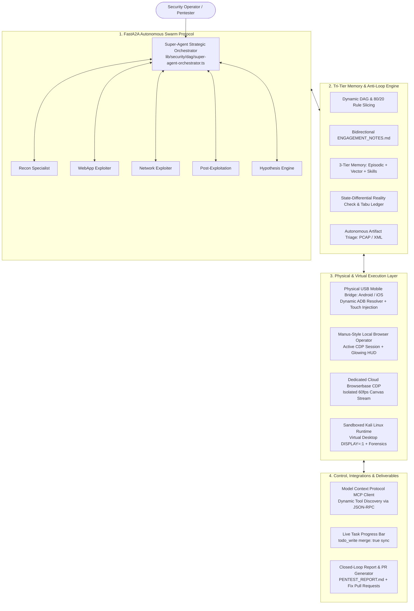

<p align="center">
  <a href="https://redhunter-ai.co.in/">
    
  </a>
</p>

<h1 align="center">RedHunter AI</h1>

<h2 align="center">Autonomous AI Red Team Operator & Multi-Agent Offensive Security Swarm</h2>

<div align="center">

[](https://redhunter-ai.co.in)
[](https://nextjs.org)
[](https://www.typescriptlang.org)
[](https://www.docker.com)
[](#3-fasta2a-multi-agent-swarm-protocol)
[-green.svg)](#1-physical-usb-mobile-hardware-bridge-android--ios)
[](#tri-mode-offensive-testing-engine)
[](LICENSE)

</div>

---

**RedHunter AI** is an enterprise-grade autonomous offensive cybersecurity platform engineered for security operations (SecOps) teams, penetration testers, and bug bounty researchers. Moving far beyond simplistic LLM wrappers and static vulnerability scanners, RedHunter AI operates as a **stateful, human-equivalent red team swarm** capable of reasoning, planning multi-phase attack trees, learning from tool execution failures, synthesizing polyglot exploit harnesses, manipulating physical mobile devices over USB, and executing full campaigns inside an isolated Kali Linux runtime.

---

## Table of Contents

- [Executive Comparison: Traditional vs. RedHunter AI](#executive-comparison-traditional-vs-redhunter-ai)
- [Tri-Mode Offensive Testing Engine](#tri-mode-offensive-testing-engine)
  - [The Power of Black Box: The True Autonomy Test](#the-power-of-black-box-the-true-autonomy-test)
  - [Multi-Surface Execution Matrix (Web, Network, Cloud, Mobile)](#multi-surface-execution-matrix)
- [10 Core Architectural Pillars & Capabilities](#10-core-architectural-pillars--capabilities)
  - [1. Physical USB Mobile Hardware Bridge (Android & iOS)](#1-physical-usb-mobile-hardware-bridge-android--ios)
  - [2. Autonomous Dual-Browser Operator (Manus-Style Local + Cloud CDP)](#2-autonomous-dual-browser-operator-manus-style-local--cloud-cdp)
  - [3. FastA2A Multi-Agent Swarm Protocol & Agent Cards](#3-fasta2a-multi-agent-swarm-protocol--agent-cards)
  - [4. Multi-Engine Desktop GUI Automation ("Computer Use")](#4-multi-engine-desktop-gui-automation-computer-use)
  - [5. Dynamic 3-Gear Action Engine & Zero-Loop Stagnation Guard](#5-dynamic-3-gear-action-engine--zero-loop-stagnation-guard)
  - [6. Tri-Tier Memory Architecture & Persistent Campaign Graph](#6-tri-tier-memory-architecture--persistent-campaign-graph)
  - [7. Sandboxed Kali Linux Runtime & Digital Forensics Suite](#7-sandboxed-kali-linux-runtime--digital-forensics-suite)
  - [8. Model Context Protocol (MCP) & Enterprise Connectors](#8-model-context-protocol-mcp--enterprise-connectors)
  - [9. Real-Time Task Progress Bar & Live State Synchronization](#9-real-time-task-progress-bar--live-state-synchronization)
  - [10. Closed-Loop PoC Verification & Remediation Patch Generator](#10-closed-loop-poc-verification--remediation-patch-generator)
- [Interactive Live Computer Studio UI](#interactive-live-computer-studio-ui)
- [Getting Started & Installation](#getting-started--installation)
  - [System Prerequisites](#system-prerequisites)
  - [Environment Configuration](#environment-configuration)
  - [Running the Sandboxed Kali Linux Runtime](#running-the-sandboxed-kali-linux-runtime)
  - [Launching the Development Server](#launching-the-development-server)
- [Comprehensive Codebase Architecture](#comprehensive-codebase-architecture)
- [Ethical Use & Responsible Disclosure](#ethical-use--responsible-disclosure)
- [License](#license)

---

## Executive Comparison: Traditional vs. RedHunter AI

```
┌─────────────────────────────────┬─────────────────────────────────┬─────────────────────────────────┐
│     TRADITIONAL PEN-TEST        │       LEGACY DAST SCANNERS      │      REDHUNTER AI PLATFORM      │
├─────────────────────────────────┼─────────────────────────────────┼─────────────────────────────────┤
│ • Annual / Periodic (1x/yr)     │ • Scheduled / Triggered scans   │ • 24/7 Continuous CART Swarm    │
│ • $30,000–$100,000 per audit    │ • $15,000–$40,000/yr licenses   │ • Bottom-up SaaS / Self-hosted  │
│ • 4–8 week turnaround           │ • Hours (produces raw output)   │ • Minutes to hours (Live PoC)   │
│ • 80-page static PDF document   │ • 70%+ False-Positive Noise     │ • Zero-Noise Verified Evidence  │
│ • Zero API logic or mobile test │ • Static regex / pattern checks │ • Multi-Step Logic & Physical   │
│ • Manual human bottleneck       │ • Zero exploit validation       │ • Deterministic Reproducible PoC│
└─────────────────────────────────┴─────────────────────────────────┴─────────────────────────────────┘
```

---

## Tri-Mode Offensive Testing Engine

RedHunter AI natively executes offensive engagements across all three standard enterprise assessment models:

```
┌─────────────────────────────────────────────────────────────────────────────────────────┐
│                               OPERATIONAL ASSESSMENT MODES                              │
├────────────────────────────┬─────────────────────────────┬──────────────────────────────┤
│ 1. BLACK BOX (Zero-Knowledge)│ 2. GREY BOX (Partial Access) │ 3. WHITE BOX (Full Visibility)│
│ • No internal credentials  │ • Low-privilege user creds  │ • Source code repository     │
│ • Zero architectural docs  │ • API schemas / swagger docs│ • Cloud IAM & IaC manifests  │
│ • Autonomous attack surface │ • Multi-tenant auth bypass  │ • Hybrid SAST + runtime DAST │
│   discovery & exploitation │ • BOLA, BFLA, privilege esc │ • Complete zero-noise proofs │
└────────────────────────────┴─────────────────────────────┴──────────────────────────────┘
```

### The Power of Black Box: The True Autonomy Test
In professional cybersecurity and institutional diligence, **Black Box testing is the definitive benchmark of AI capability**. 

When starting in Black Box mode:
1. The operator provides **only a single unknown target** (e.g. an external domain, CIDR IP block, or raw mobile APK file) with **zero prior credentials or internal documentation**.
2. The AI must autonomously navigate the entire cyber kill chain:
   - Perimeter reconnaissance and OSINT mapping.
   - Network port scanning and service fingerprinting.
   - Technology stack and WAF detection.
   - Dynamic fuzzing and vulnerability discovery (OWASP Top 10, API flaws, logic defects).
   - Formulating attack paths, chaining multi-step exploits, and proving real compromise with reproducible PoC traces.
   - Compiling a professional, executive-ready remediation report with CVSS 3.1/4.0 metrics.

### Multi-Surface Execution Matrix

| Attack Surface | ⬛ **Black Box Execution (Zero Knowledge)** | 🔘 **Grey Box Execution (Partial Access)** | ⬜ **White Box Execution (Full Code & Architecture)** |
| :--- | :--- | :--- | :--- |
| **🌐 Web & Modern APIs** | Perimeter OSINT, subdomain crawling, WAF fingerprinting, OWASP Top 10 (SQLi, XSS, SSRF, SSTI), parameter tampering, blind command injection. | Authenticated BOLA/IDOR auditing, Tenant A vs. Tenant B privilege escalation, JWT manipulation, business logic flaws. | Static code taint tracking in repositories combined with live dynamic PoC execution to verify exploitability. |
| **🔌 Network & Infrastructure** | High-speed port scanning (`naabu`, `nmap`), banner grabbing, exposed admin panels (SSH, RDP, Redis, Elasticsearch), default password audits. | Internal network pivoting from initial footholds, Active Directory / Kerberos abuse, pass-the-hash, lateral movement. | Firewall ruleset inspection, network routing topology review, zero-trust segmentation validation. |
| **☁️ Cloud (AWS, GCP, Azure, K8s)** | Unauthenticated bucket enumeration (S3, GCS, Blobs), exposed container registries, metadata service SSRF (IMDSv1/v2). | Low-privilege IAM credential exploitation, privilege escalation paths (`iam:PassRole`, `sts:AssumeRole`), trust hopping. | Infrastructure-as-Code (Terraform, CloudFormation, K8s YAML) audit, least-privilege IAM matrix review, CIS Benchmarks. |
| **📱 Mobile (Android & iOS)** | Dynamic APK/IPA tampering, SSL pinning bypass, physical USB touch automation, exported Activity/IPC fuzzing. | Authenticated mobile API flow testing, local SQLite database extraction (`run-as`), biometric logic bypasses. | Smali/Java bytecode decompilation, hardcoded secret harvesting, cryptographic implementation audits. |

---

## 10 Core Architectural Pillars & Capabilities



---

### 1. Physical USB Mobile Hardware Bridge (Android & iOS)
* **What it does**: Enables the AI agent to interact directly with live physical Android phones, iPhones, and local emulators connected via USB.
* **How it works**:
  * **Dynamic ADB Resolver (`lib/mobile/adb-resolver.ts`)**: Automatically discovers ADB binaries and Android SDKs across Windows (`%LOCALAPPDATA%`, `PATH`), macOS (`Homebrew`, `~/Library/Android/sdk`), and Linux (`/usr/bin/adb`) without hardcoded system paths.
  * **Touch & Key Automation (`/system/bin/input`)**: Injects touch taps at exact pixel coordinates (`tap_screen [x, y]`), directional swipes (`swipe_screen [x1, y1, x2, y2, durationMs]`), text typing, and hardware buttons (`HOME`, `BACK`, `POWER`, `ENTER`, `RECENTS`).
  * **Lossless Visual Screen Capture**: Takes full 1080x2400 AMOLED screencaps, stores them to disk, and simultaneously runs `uiautomator dump` to parse the on-screen accessibility tree (text labels and clickable element bounds).
  * **App Lifecycle & Storage Audit**: Discovers installed third-party apps (`pm list packages -3`), extracts APK binaries (`pm path`), inspects sandboxed databases (`run-as <pkg> cat databases/...`), and fuzzes exported Activities (`am start`).

### 2. Autonomous Dual-Browser Operator (Manus-Style Local + Cloud CDP)
* **What it does**: Automates web application penetration testing through two complementary browser engines.
* **How it works**:
  * **Manus-Style Local Browser Operator (`lib/browser/local-browser-operator.ts`)**: Connects via Chrome DevTools Protocol (CDP) to the operator's active Google Chrome or Microsoft Edge browser. Inherits logged-in enterprise sessions (AWS Console, GitHub, Jira, PortSwigger, CTF portals) without credential sharing.
  * **Visual HUD & Human Shield**: Injects a prominent neon perimeter on the active tab, enforces an interaction lock shield to prevent click collisions, and displays a floating badge `[ 🛡️ RedHunter AI is browsing... [Take over] ]` for immediate manual override.
  * **20/20 Spatial Vision Grounding**: Converts viewports into spatial `(x, y)` coordinate grids via Gemini 2.0 Flash and Claude 3.5 Sonnet Vision models, eliminating fragile DOM CSS/XPath selectors.
  * **Dedicated Cloud Browser (Browserbase + Stagehand)**: Dispatches untrusted or malicious URLs into an isolated remote browser environment, streaming full 60fps canvas replays to the user's Studio UI.

### 3. FastA2A Multi-Agent Swarm Protocol & Agent Cards
* **What it does**: Coordinates specialized subordinate AI agents across isolated memory frames to eliminate context window bloat during multi-hour campaigns.
* **How it works**:
  * **Standardized Agent Cards (`.well-known/agent.json`)**: Every agent and remote peer node exposes a standardized JSON capability card detailing supported protocols, specialized toolchains, and hardware bindings.
  * **Specialized Subordinate Delegation (`call_subordinate_a2a_agent`)**:
    * `recon_specialist`: Subdomain enumeration, ASN discovery, port fingerprinting.
    * `exploit_reviewer`: Binary triage, disassembly, PoC validation.
    * `code_auditor`: Static analysis (SAST), taint tracking, dependency auditing.
    * `network_exploiter`: Protocol fuzzing, lateral movement, internal pivoting.
  * Subordinate agents execute in parallel and stream structured JSON findings and evidence artifacts back to the primary engagement graph.

### 4. Multi-Engine Desktop GUI Automation ("Computer Use")
* **What it does**: Operates desktop security suites, Wireshark, Burp Suite, Postman, and legacy GUI applications running inside Kali Linux Virtual Desktop (`DISPLAY=:1`).
* **How it works**:
  * **Engine 1 (Fast Frame Grab)**: High-speed frame capture using `mss` shared memory and `scrot` for sub-100ms desktop streaming over WebSockets.
  * **Engine 2 (Input Injection)**: Injects mouse clicks (`left_click`, `double_click`, `right_click`, `drag`), mouse movement, and keyboard strokes via `xdotool`, `xte`, and `ydotool`.
  * **Engine 3 (Semantic AT-SPI)**: Connects to the Linux Accessibility Tree (`pyatspi` / `Dogtail`) to click buttons and navigate menus by semantic label rather than brittle pixel coordinates.
  * **Engine 4 (Task Multiplexing)**: Manages long-running background GUI scans inside headless `tmux` sessions.

### 5. Dynamic 3-Gear Action Engine & Zero-Loop Stagnation Guard
* **What it does**: Eliminates "analysis paralysis", prevents circular reasoning loops, and selects the most effective attack path at machine speed.
* **How it works**:
  * **3-Gear Transmission**:
    * *Gear 1 (Instant Reflex)*: Physical mobile actions and single-command checks execute with **0 thinking tokens**.
    * *Gear 2 (Speculative Parallel Canaries)*: Formulates 2–4 lightweight non-blocking canary checks (`security_speculative_probe`) executed concurrently via `Promise.all`. Reality selects the winning vector in 1 turn.
    * *Gear 3 (Swarm DAG Fanout)*: Deconstructs large engagements into parallel sub-tasks dispatched to subordinate agents.
  * **State-Differential Reality Check**: Monitors environment state deltas (exit codes, output signatures). If 2 turns produce zero state progress, it triggers an immediate **State-Stagnation Break**.
  * **Tabu (Pruned Vectors) Ledger**: Permanently records failed vectors and injects negative constraints into session memory, strictly forbidding the model from re-attempting dead ends (e.g. endless offline hash cracking).

### 6. Tri-Tier Memory Architecture & Persistent Campaign Graph
* **What it does**: Persists intelligence across long-term engagements and eliminates redundant reconnaissance.
* **How it works**:
  * **Tier 1 (Episodic Memory)**: Tracks live engagement state: active IP scopes, compromised hosts, discovered credentials, and chronological attack timeline.
  * **Tier 2 (Semantic Memory)**: Vector database indexing past vulnerability disclosures, CVE signatures, and organizational target profiles.
  * **Tier 3 (Collective Skills)**: Captures successful command and browser traces, scrubs confidential tokens, and persists 1-shot execution recipes for reuse across future sessions.
  * **Bidirectional Global Notebook (`ENGAGEMENT_NOTES.md`)**: Automatically syncs notes between operator and AI on disk every 4 seconds.

### 7. Sandboxed Kali Linux Runtime & Digital Forensics Suite
* **What it does**: Equips the AI with an isolated Docker container (`redhunter-sandbox`) pre-loaded with full offensive and forensic toolchains without endangering the host system.
* **How it works**:
  * **Offensive Toolset**: `nmap`, `naabu`, `httpx`, `ffuf`, `dirsearch`, `sqlmap`, `hydra`, `nuclei`, `trivy`, `subfinder`, `katana`, `trufflehog`.
  * **Digital Forensics Suite**:
    * The Sleuth Kit (`fls`, `tsk_recover`, `mmls`) for analyzing raw disk dumps (`.dd`, `.raw`, `.img`).
    * `bulk_extractor` for carving memory dumps and unallocated disk space for URLs, emails, and credit cards.
    * `photorec` and `testdisk` for file recovery.
    * `binwalk` for firmware and embedded filesystem extraction.
    * `tshark` and `tcpdump` for automated `.pcap` protocol analysis.
    * `radare2`, `strings`, `xxd`, `exiftool`, `sqlite3` for binary reverse engineering.

### 8. Model Context Protocol (MCP) & Enterprise Connectors
* **What it does**: Connects RedHunter AI bidirectionally to enterprise SaaS, ticketing, and cloud infrastructure.
* **How it works**:
  * **Anthropic MCP Client & Server (`lib/mcp/mcp-client.ts`)**: Dynamically registers external tools and exposes RedHunter AI capabilities via JSON-RPC 2.0.
  * **Composio Integration (`lib/integrations/composio-client.ts`)**: Built-in support for 100+ platforms including GitHub, Jira, Slack, AWS, Linear, and Gmail.
  * **Pipedream Client (`lib/integrations/pipedream-client.ts`)**: Triggers automated webhooks to notify SecOps teams when critical vulnerabilities are confirmed.

### 9. Real-Time Task Progress Bar & Live State Synchronization
* **What it does**: Keeps the operator in complete control with an interactive, live-updating task checklist.
* **How it works**:
  * The agent proactively breaks down multi-step objectives into structured checklists (`todo_write`).
  * As each phase finishes (e.g. Reconnaissance), the agent invokes `todo_write({ merge: true, ... })` to mark the finished task `completed` and the next task `in_progress`.
  * The frontend dynamically renders the live progress bar (`1 / 4` ➔ `2 / 4` ➔ `3 / 4` ➔ `4 / 4`), updating checkmarks in real time without screen refresh.

### 10. Closed-Loop PoC Verification & Remediation Patch Generator
* **What it does**: Delivers verified vulnerability proofs and automatically generates developer pull requests.
* **How it works**:
  * **Single Final Deliverable**: Findings are compiled into an executive deliverable (`/home/user/workspace/PENTEST_REPORT.md`) during the dedicated reporting phase, preventing premature report spamming.
  * **Deterministic Proof-of-Exploit**: Every vulnerability includes raw HTTP request/response logs, terminal traces, and reproducible `curl` or Python scripts.
  * **Automated Code Remediation**: Generates actionable code `diff` patches (e.g. parameterized queries, authorization middleware) formatted as ready-to-merge GitHub pull requests.

---

## Interactive Live Computer Studio UI

RedHunter AI features an integrated multi-tab workspace designed for security operators:

```
┌───────────────────────────────────────┬───────────────────────────────────────────────────────┐
│              CHAT / PROMPT STREAM     │                LIVE COMPUTER STUDIO                   │
├───────────────────────────────────────┼───────────────────────────────────────────────────────┤
│ [Reconnaissance: Enumerate endpoints] │ [>_ Terminal] [</> Code] [🌐 Browser] [🖥️ Desktop]    │
│                                       ├───────────────────────────────────────────────────────┤
│ [✓] Found open port 3000 (Node.js)    │ kali@sandbox:~$ nmap -sV -p- 10.0.5.10                │
│ [✓] Discovered SQLi on /rest/products │ PORT     STATE SERVICE VERSION                        │
│ [→] Testing privilege escalation...   │ 3000/tcp open  http    Node.js Express framework      │
│                                       │                                                       │
│ Task progress: [ 2 / 4 ] (50%)        │ ----------------------------------------------------- │
│                                       │ PENTEST_REPORT.md | EXPLORER: 24 files                │
└───────────────────────────────────────┴───────────────────────────────────────────────────────┘
```

* **Terminal Tab**: Direct interactive shell access to the Kali Linux container.
* **Code Editor Tab**: Built-in syntax-highlighted IDE for inspecting scripts, wordlists, and PoC exploits.
* **Browser Tab**: Live dual-browser viewer streaming cloud CDP canvas replays or local operator sessions.
* **Desktop Tab**: Interactive noVNC stream of the Kali Linux XFCE desktop (`DISPLAY=:1`).
* **Files Tab**: Real-time explorer for browsing and downloading campaign artifacts, `.pcap` files, and reports.

---

## Getting Started & Installation

### System Prerequisites

* **Operating System**: Linux, macOS, or Windows (WSL2 recommended for Windows).
* **Node.js**: `v20.x` or higher.
* **Package Manager**: `pnpm` (`v9.x` or higher).
* **Docker Engine**: Installed and running (for the Kali Linux sandbox container).
* **Android SDK / ADB** *(optional)*: For physical USB mobile penetration testing.

---

### Environment Configuration

1. **Clone the repository:**
   ```bash
   git clone https://github.com/SunnyThakur25/REDHUNTER-AI.git
   cd REDHUNTER-AI
   ```

2. **Install dependencies:**
   ```bash
   pnpm install
   ```

3. **Configure environment variables:**
   ```bash
   cp .env.local.example .env.local
   ```
   Open `.env.local` and populate the required API keys:
   ```env
   # LLM Model Providers
   OPENROUTER_API_KEY="sk-or-v1-..."
   # Or direct providers:
   ANTHROPIC_API_KEY="sk-ant-..."
   OPENAI_API_KEY="sk-..."
   GEMINI_API_KEY="..."

   # Real-Time Backend (Convex)
   NEXT_PUBLIC_CONVEX_URL="https://your-deployment.convex.cloud"

   # Authentication & Workspaces (WorkOS)
   WORKOS_API_KEY="sk_..."
   WORKOS_CLIENT_ID="client_..."
   WORKOS_COOKIE_PASSWORD="32-character-random-password-here"

   # Optional Sandbox / Cloud Services
   E2B_API_KEY="..."
   BROWSERBASE_API_KEY="..."
   TAVILY_API_KEY="..."
   ```

4. **Initialize Convex Backend:**
   ```bash
   pnpm dlx convex dev
   ```

---

### Running the Sandboxed Kali Linux Runtime

RedHunter AI executes security commands inside an isolated Docker container (`redhunter-sandbox`):

```bash
# Pull or build the Kali sandbox image
docker run -d --name redhunter-sandbox \
  -p 4200:4200 \
  -p 5901:5901 \
  -p 6080:6080 \
  -v redhunter-workspace:/home/user/workspace \
  pentest-copilot-main-kali:latest
```

---

### Launching the Development Server

Start the Next.js development server:

```bash
pnpm run dev
```

Open [http://localhost:3000](http://localhost:3000) in your browser.

---

## Comprehensive Codebase Architecture

```
redhunter-ai/
├── app/
│   ├── (chat)/                             # Primary chat interface & conversational runtime
│   │   └── page.tsx                        # Main landing & interactive prompt dashboard
│   ├── api/
│   │   ├── chat/route.ts                   # Core streaming endpoint & AI orchestration
│   │   ├── sandbox/                        # Sandbox proxy: files, terminal, desktop
│   │   └── browser-operator/               # Local Chrome/Edge CDP bridge endpoints
│   ├── components/
│   │   ├── chat.tsx                        # Chat state, message rendering, tool streaming
│   │   ├── ComputerSidebar.tsx             # Live Studio: Terminal, Code, Desktop, Browser
│   │   ├── TodoPanel.tsx                   # Live floating Task Progress Bar widget
│   │   ├── QueuedMessagesPanel.tsx         # Mid-flight message steering panel
│   │   ├── ReportsLibraryDialog.tsx        # Professional pentest report exporter
│   │   └── ScheduledScansDialog.tsx        # Continuous CART scheduling interface
├── lib/
│   ├── ai/
│   │   ├── tools/                          # Vercel AI SDK Tool Implementations
│   │   │   ├── run-terminal-cmd.ts         # Kali Linux CLI execution & anti-loop engine
│   │   │   ├── todo-write.ts               # Task progress planning & live synchronization
│   │   │   ├── mobile-touch.ts             # USB mobile touch & gesture injection
│   │   │   ├── mobile-screencap.ts         # AMOLED screen capture + uiautomator parser
│   │   │   └── mobile-app-control.ts       # App launch, package list, APK dump
│   │   ├── providers.ts                    # Multi-model routing (Claude, GPT-4o, Gemini, DeepSeek)
│   │   └── self-healing-loop.ts            # Self-correction & anti-stagnation guards
│   ├── browser/
│   │   ├── local-browser-operator.ts       # Manus-style local CDP browser bridge
│   │   └── stagehand-browser.ts            # Dedicated cloud browser automation
│   ├── mobile/
│   │   └── adb-resolver.ts                 # Dynamic cross-platform ADB binary resolver
│   ├── desktop/
│   │   ├── agent-desktop.ts                # 4-Engine Linux Virtual Desktop computer use
│   │   └── screen-capture.ts               # Shared memory mss/scrot frame grabber
│   ├── security/
│   │   ├── dag/                            # Super-Agent Orchestrator & DAG execution
│   │   ├── memory/                         # Tri-tier memory (Episodic, Semantic, Skills)
│   │   ├── stealth/                        # Tactical evasion & WAF detection
│   │   ├── hypothesis/                     # Polyglot logic and protocol fuzzers
│   │   └── reporting/                      # Deliverable generator (CVSS 3.1/4.0, Mermaid)
│   ├── mcp/
│   │   ├── mcp-client.ts                   # Anthropic Model Context Protocol client
│   │   └── mcp-server.ts                   # Standardized MCP server implementation
│   ├── integrations/
│   │   ├── composio-client.ts              # Composio enterprise connector (100+ apps)
│   │   └── pipedream-client.ts             # Pipedream webhook dispatch engine
│   └── system-prompt.ts                    # Autonomous agent prompt & methodology assembler
└── public/
    └── captures/                           # Lossless mobile screencaps & desktop traces
```

---

## Ethical Use & Responsible Disclosure

> **IMPORTANT LEGAL NOTICE**:
> 
> RedHunter AI is designed exclusively for authorized penetration testing, vulnerability assessment, red teaming exercises, and defensive security validation.
> 
> Testing against networks, web applications, cloud infrastructure, or mobile devices without prior explicit, written consent from the asset owner is illegal and unethical. The creators, contributors, and maintainers of RedHunter AI accept no liability and are not responsible for any misuse, damage, or legal consequences resulting from this software.

---

## License

This project is licensed under the MIT License — see the [LICENSE](LICENSE) file for details.
